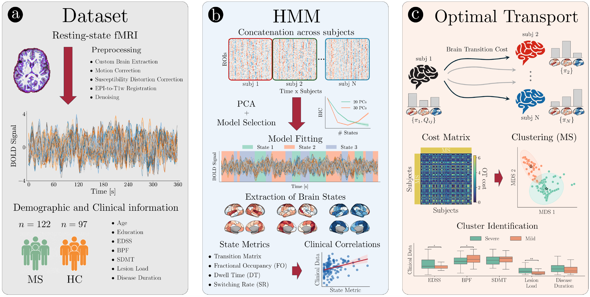

# Discovery of Latent Clinical Phenotypes Through Optimal Transport of Brain Dynamics

## Overview
This repository implements an HMM-OT framework to quantify inter-individual variability in resting-state brain dynamics. Gaussian Hidden Markov Models (HMM) represent resting-state fMRI as transitions among shared latent dynamical states, summarizing each subject as a probability distribution over this latent state space. Optimal Transport (OT) then computes the cost between subjects’ state distributions, yielding a dissimilarity measure that captures temporal information beyond static connectivity.

## Application
Applied to resting-state fMRI from relapsing–remitting multiple sclerosis (RRMS) patients and matched healthy controls to study within-cohort heterogeneity and identify data-driven subgroups.

### Notebooks
- `hmm_ot_analyses.ipynb` - main analyses: Gaussian HMM inference and Optimal Transport–based subject dissimilarities.
- `supp_analyses_panels.ipynb` - supplementary analyses and figure/panel generation.
 
## Libraries
- Dynamax (Gaussian HMM): https://github.com/probml/dynamax
- POT — Python Optimal Transport: https://github.com/PythonOT/POT
